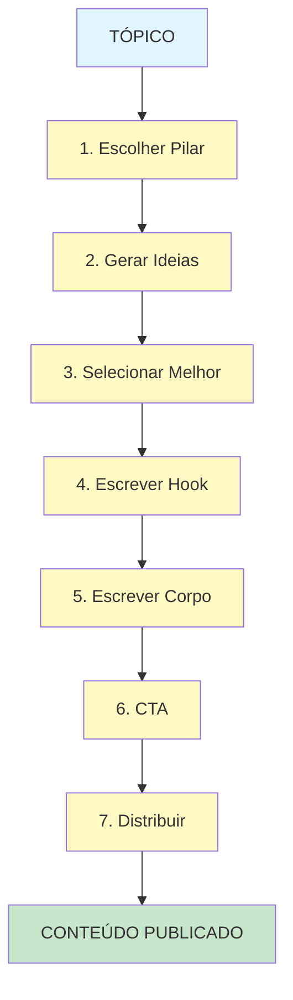
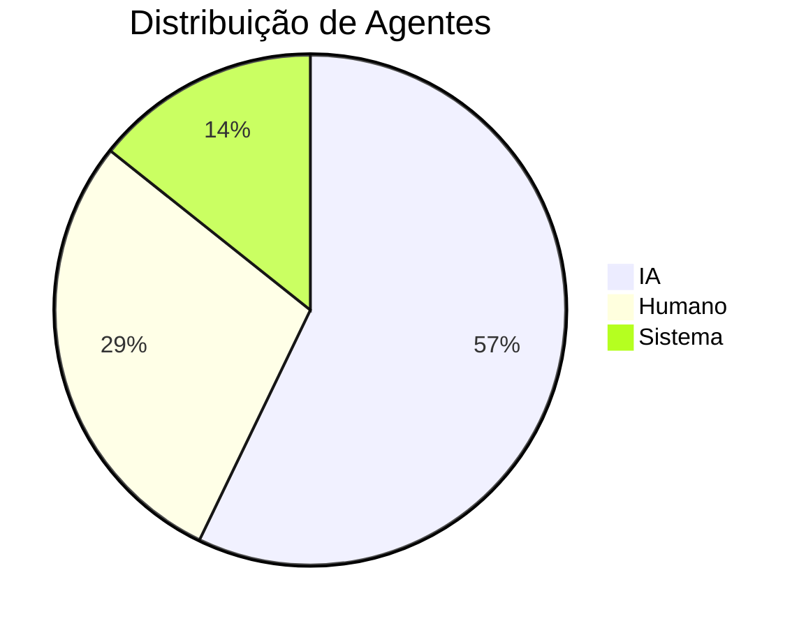
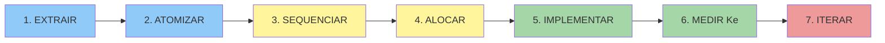

# EXEMPLO COMPLETO — Content Rocket System

> **Metodologia fictícia documentada usando framework MAAS.**
> **Este é um exemplo de como preencher o template de metodologia completa.**

---

# Content Rocket System

## Snapshot

| Campo | Conteúdo |
|-------|----------|
| **Expert** | Sarah Creator (fictício) |
| **Propósito** | Criar conteúdo viral consistente em 30 minutos/dia |
| **Transformação** | Sobrecreative sem sistema → Máquina de conteúdo consistente |
| **Público** | Criadores, empreendedores, marketers |
| **Data** | Janeiro 2025 |
| **Versão** | 1.0 |

---

## As 4 Causas

### Causa Material — Do que é feito?

**DECISÕES SEQUENCIADAS** — A metodologia é composta por 7 decisões:

1. Escolher o Pilar de Conteúdo
2. Gerar 10 Ideias em 5 minutos
3. Selecionar a Melhor Ideia (Scorecard)
4. Escrever o Hook (3 segundos)
5. Escrever o Corpo (Framework PAS)
6. Criar Call-to-Action
7. Distribuir com Estratégia

---

### Causa Formal — Qual a estrutura?

**INPUT → TRANSFORMAÇÃO → OUTPUT** (em cascata)

```
[Tópico] → [7 Átomos] → [Conteúdo Publicado]
  ↓          ↓               ↓
Único    Cada output     Multi-plataforma
         vira input
         do próximo
```

---

### Causa Eficiente — O que faz funcionar?

**Distribuição de Agentes:**

| Agente | Átomos | % |
|--------|--------|---|
| **IA** | 4 | 57% |
| **Humano** | 2 | 29% |
| **Sistema** | 1 | 14% |

**Filosofia:** "IA cria rascunho, humano aprova, sistema distribui."

---

### Causa Final — Para que serve?

**REDUZIR FRICÇÃO** entre "ter ideias" e "ter conteúdo publicado".

**Problema:** Criadores gastam 3+ horas em um post, publicam inconsistente.

**Promessa:** 30 minutos/dia, conteúdo diário garantido.

---

## Anatomia (5 Partes)

### Parte 1: ESTADO A — Ponto de Partida

**Quem é?**
Criador de conteúdo com 6-12 meses de experiência, publicando de forma irregular (2-3x/semana), sentindo bloqueio criativo frequentemente.

**O que TEM?**
- Seguidores (5K-50K)
- Nicho definido (mas não claramente)
- Algum conteúdo anterior
- Smartphone + acesso a IA

**O que NÃO TEM?**
- Sistema de criação
- Consistência
- Framework para ideias
- Estratégia de distribuição

**Por que mudar?**
- Algoritmo premia consistência
- Criador sente culpa por não postar
- Crescimento estagnou
- Competidores com menos talento mas mais consistência ganham

---

### Parte 2: TRANSFORMAÇÕES — Átomos



#### Tabela de Átomos

| ID | Nome | Input | Decisão | Output | Agente | Fricção |
|----|------|-------|---------|--------|--------|---------|
| A1 | Escolher Pilar | Nicho | Qual pilar hoje? | Pilar selecionado | Humano | Cognitiva |
| A2 | Gerar Ideias | Pilar | Gerar 10 variações | Lista de 10 | IA | Temporal |
| A3 | Selecionar | Lista 10 | Qual tem maior score? | Top 1 | Sistema | Cognitiva |
| A4 | Hook | Top 1 | Escrever hook viral | Hook escrito | IA | Cognitiva |
| A5 | Corpo | Hook | Expandir com PAS | Conteúdo | IA | Temporal |
| A6 | CTA | Conteúdo | Qual conversão? | CTA | Humano | Motivacional |
| A7 | Distribuir | Post | Onde publicar? | Multi-plataforma | Sistema | Operacional |

---

### Parte 3: ESTADO B — Ponto de Chegada

**O que TEM agora?**
- Conteúdo diário publicado
- Biblioteca de 100+ ideias
- Scorecard validado
- Sistema replicável

**O que MUDOU?**
| Antes | Depois |
|-------|--------|
| 2-3 posts/semana | 7 posts/semana |
| 3h por post | 30min por post |
| Bloqueio frequente | Nunca sem ideias |
| Uma plataforma | 3 plataformas |

**Como SABER?**
- Checklist diário completo
- 30 posts no último mês
- Engajamento mantido ou aumentado
- Tempo gasto: 30min/dia

---

### Parte 4: FRICÇÕES — Mapeamento

| Átomo | Cognitiva | Operacional | Motivacional | Temporal | Financeira |
|-------|-----------|-------------|---------------|----------|------------|
| A1 Escolher Pilar | Alta (qual pilar?) | — | — | — | — |
| A2 Gerar Ideias | Média | — | — | Alta | — |
| A3 Selecionar | Alta | — | — | — | — |
| A4 Hook | Alta | — | — | — | — |
| A5 Corpo | — | — | — | Alta | — |
| A6 CTA | Alta | — | Média | — | — |
| A7 Distribuir | — | Alta | — | — | — |

**Mitigações:**
- **Cognitiva** → Scorecard numérico, não "achar"
- **Temporal** → IA acelera geração
- **Operacional** → Script auto-distribui
- **Motivacional** → Gamificação (streaks)

---

### Parte 5: AGENTES — Alocação

**Matriz de Decisão:**

| Átomo | 1. Tipo | 2. Fricção | 3. Risco | Agente |
|-------|---------|-------------|----------|--------|
| A1 | Prob | Cognitiva | Médio | Humano |
| A2 | Prob | Temporal | Baixo | IA |
| A3 | Det | Cognitiva | Baixo | Sistema |
| A4 | Prob | Cognitiva | Baixo | IA |
| A5 | Prob | Temporal | Baixo | IA |
| A6 | Prob | Cogn/Mot | Médio | Humano |
| A7 | Det | Operacional | Baixo | Sistema |

**Distribuição Visual:**



---

## Pipeline (7 Passos)



**Status:**

| Passo | Status | Data |
|-------|--------|------|
| 1. EXTRAIR | ✓ | Jan 2025 |
| 2. ATOMIZAR | ✓ | Jan 2025 |
| 3. SEQUENCIAR | ✓ | Jan 2025 |
| 4. ALOCAR | ✓ | Jan 2025 |
| 5. IMPLEMENTAR | ⏳ | Em andamento |
| 6. MEDIR Ke | ⏳ | Pendente |
| 7. ITERAR | — | Futuro |

---

## Equação Ke

### Cálculo

```
Ke = (T × A × M × AmpIA) ÷ Lc
Ke = (0.85 × 0.90 × 0.85 × 7.0) ÷ 0.5
Ke = 9.12
```

| Variável | Valor | Alvo | Status |
|----------|-------|------|--------|
| T | 0.85 | 0.8+ | ✓ |
| A | 0.90 | 0.8+ | ✓ |
| M | 0.85 | 0.8+ | ✓ |
| Amp | 7.0 | 5.0+ | ✓ |
| Lc | 0.5 | <0.5 | ⚠️ |

### Comparativo

| Estado | T | A | M | Amp | Lc | Ke |
|--------|---|---|---|-----|----|----|
| **PRÉ-MaaS** | 0.4 | 0.5 | 0.3 | 1.0 | 1.8 | **0.03** |
| **COM-MaaS** | 0.85 | 0.90 | 0.85 | 7.0 | 0.5 | **9.12** |

**Multiplicador: 304×**

---

## Scorecard de Ideias (Átomo 3)

### Como Funciona

Cada ideia recebe 0-10 pontos em 4 critérios:

| Critério | Peso | 0-10 | Exemplo |
|----------|------|------|---------|
| **Viralidade** | 30% | 0=nada, 10=tendência | "IA substituindo devs" |
| **Relevância** | 30% | 0=fora, 10=nicho | "Criadores usando IA" |
| **Originalidade** | 20% | 0=cópia, 10=novo | "Framework novo" |
| **Execução** | 20% | 0=difícil, 10=fácil | "Post simples" |

**Score = (V × 0.3) + (R × 0.3) + (O × 0.2) + (E × 0.2)**

**Regra:** Score ≥ 7 = publicar, < 7 = descartar ou reframe.

---

## Prompt Template (Átomo 4 - Hook)

```
# Papel
Você é um copywriter especialista em hooks virais para [NÍCIO].

# Input
- Tópico: [TÓPICO]
- Score: [SCORE]
- Plataforma: [LinkedIn/Instagram/TikTok]

# Tarefa
Escreva 5 variações de hook com máx 150 caracteres cada.

# Frameworks
1. Controvérsia: "O oposto do que todos pensam..."
2. Número: "3 coisas que ninguém te conta..."
3. Story: "Eu perdi $10K para descobrir..."
4. Curiosidade: "O segredo que..."
5. Urgência: "Se você não fizer isso em 2024..."

# Output
Lista numerada, 5 hooks, cada um com score de viralidade (0-10).
```

---

## Script de Distribuição (Átomo 7)

### Sistema (pseudo-código)

```python
def distribuir_conteudo(conteudo, plataformas):
    """
    Distribui conteúdo formatado para múltiplas plataformas
    """
    for plataforma in plataformas:
        if plataforma == "linkedin":
            # Formata para LinkedIn (quebras de linha, hashtags)
            post = formatar_linkedin(conteudo)
        elif plataforma == "instagram":
            # Formata para Instagram (menos texto, mais emojis)
            post = formatar_instagram(conteudo)
        elif plataforma == "tiktok":
            # Gera roteiro para vídeo
            post = gerar_roteiro_video(conteudo)

        # Publica via API
        api.publicar(plataforma, post)

    return {"status": "publicado", "plataformas": plataformas}
```

---

## Validação

### Checklist de Qualidade

Antes de publicar, verificar:

- [ ] Hook tem < 150 caracteres
- [ ] Hook segue um dos 5 frameworks
- [ ] Conteúdo tem estrutura PAS (Problema-Agitação-Solução)
- [ ] CTA é específico e mensurável
- [ ] Score da ideia ≥ 7
- [ ] Tempo total ≤ 30 minutos

---

## Iteração Futura

### Próximas Melhorias

| Prioridade | Melhoria | Impacto | Effort |
|------------|----------|---------|--------|
| 1 | Automatar A7 completamente | Alto | Alto |
| 2 | Adicionar IA para imagens | Médio | Médio |
| 3 | Criar versão para vídeo | Alto | Alto |
| 4 | Gamificar streaks | Médio | Baixo |

### Variável Ke a Melhorar

**Prioridade: Lc (Limite Cognitivo)**

- Atual: 0.5
- Alvo: 0.3
- Ação: Criar UI/UX que guia todo o processo, sem precisar de decisões

---

## Metadados

- **Data de criação:** Janeiro 2025
- **Versão:** 1.0
- **Status:** Exemplo educacional

---

**FIM DO EXEMPLO COMPLETO**

> Este é um exemplo FICTÍCIO de como documentar uma metodologia usando MAAS.
> Use este documento como referência ao preencher `templates/methodology.md`.
