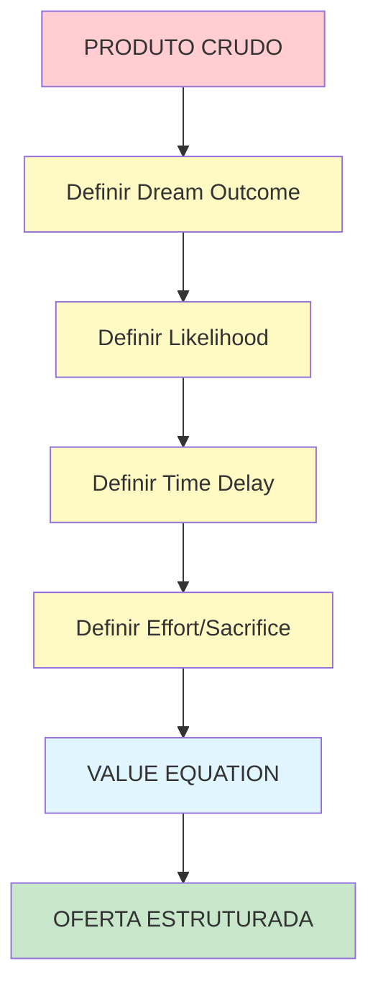
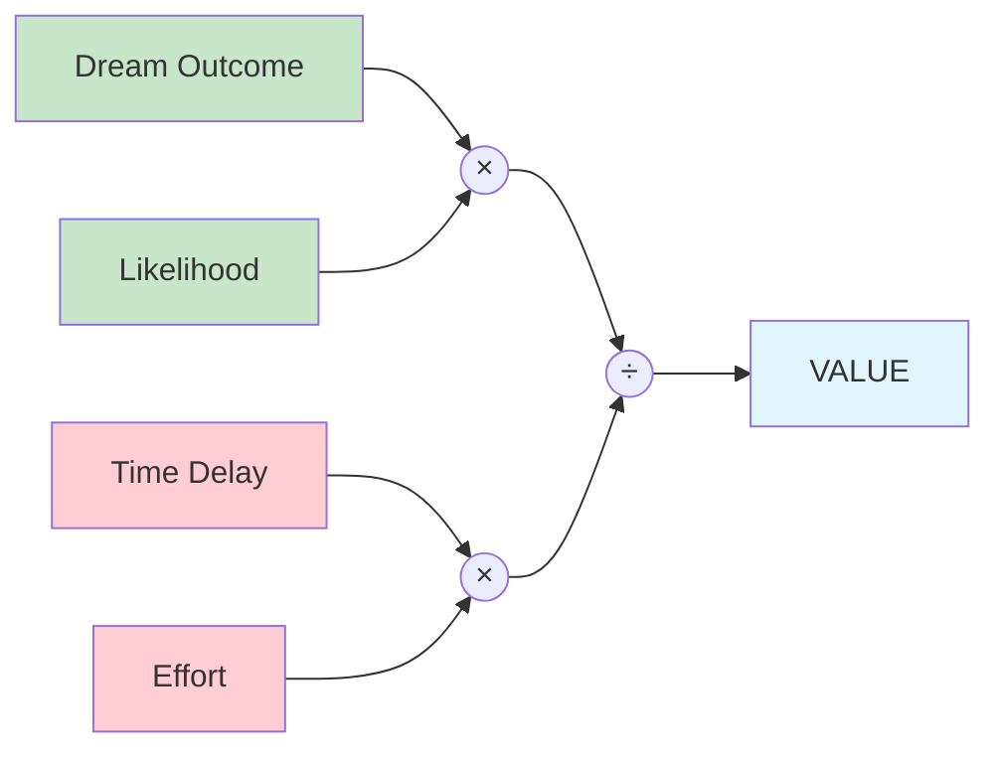

# EXEMPLO — Value Equation (Alex Hormozi)

> **Metodologia extraída e documentada usando framework MAAS.**
> **Expert:** Alex Hormozi
> **Contexto:** Framework para criar ofertas irresistíveis

---

## Snapshot

| Campo | Conteúdo |
|-------|----------|
| **Expert** | Alex Hormozi |
| **Propósito** | Criar ofertas que clientes sentem que "seriam loucos para recusar" |
| **Transformação** | Ideia vaga → Oferta estruturada com Value Equation |
| **Público** | Empreendedores, founders, marketers |
| **Fonte** | $100M Offers book e conteúdo público |

---

## As 4 Causas

### Causa Material (Decisões)

A Value Equation é composta por 4 decisões sequenciadas:

1. **Definir o Dream Outcome** — O que o cliente quer alcançar
2. **Definir a Likelihood of Achievement** — Quão provável é conseguir
3. **Definir o Time Delay** — Quanto tempo leva
4. **Definir o Effort & Sacrifice** — Quanto esforço/custo exige

```
Value = (Dream Outcome × Perceived Likelihood of Achievement)
        ──────────────────────────────────────────────────────
                    (Time Delay × Effort & Sacrifice)
```

---

### Causa Formal (Estrutura)

**INPUT** → **TRANSFORMAÇÃO** → **OUTPUT**

```
[Problema/Ideia] → [Value Equation] → [Oferta Estruturada]
      ↓                    ↓                    ↓
   "Quero          Calcula as        "Oferta com
    vender"         4 variáveis       valor claro"
```

---

### Causa Eficiente (Agente)

**Humano + IA** — O expert define a estratégia, IA apoia na estruturação

---

### Causa Final (Propósito)

**REDUZIR FRICÇÃO** entre "ter uma ideia" e "ter uma oferta com valor claro e mensurável".

---

## Anatomia (5 Partes)

### Estado A — Ponto de Partida

**Quem é?** Empreendedor com produto/serviço mas sem oferta clara.

**O que TEM?**
- Produto ou serviço
- Alguns clientes (talvez)
- Conhecimento do mercado

**O que NÃO TEM?**
- Oferta estruturada
- Valor quantificado
- Diferenciação clara

**Por que mudar?** Oferta sem valor claro = difícil vender = preço baixo = margem baixa.

---

### Transformações — Átomos de Decisão



#### Átomo 1: Definir Dream Outcome

| Campo | Conteúdo |
|-------|----------|
| **Input** | Produto/serviço + público-alvo |
| **Decisão** | "Qual é o resultado final que o cliente quer?" |
| **Output** | Dream Outcome qualificado e específico |
| **Agente** | Humano + IA |
| **Fricção** | Cognitiva (dificuldade de ser específico) |

**Exemplo:**
- ❌ "Ajudo com marketing"
- ✓ "Empreendedores fazem $100K/mês em 90 dias sem gastar em ads"

---

#### Átomo 2: Definir Likelihood of Achievement

| Campo | Conteúdo |
|-------|----------|
| **Input** | Dream Outcome |
| **Decisão** | "Como PROVAMOS que eles vão conseguir?" |
| **Output** | Provas, garantias, cases |
| **Agente** | IA + Humano |
| **Fricção** | Operacional (coletar provas) |

**Exemplo:**
- Garantia incondicional 30 dias
- Case studies: "300+ alunos, média de $47K/mês"
- Testemunhais com resultados

---

#### Átomo 3: Definir Time Delay

| Campo | Conteúdo |
|-------|----------|
| **Input** | Dream Outcome + Provas |
| **Decisão** | "Quanto tempo até ver resultados?" |
| **Output** | Timeline específica |
| **Agente** | Humano |
| **Fricção** | Temporal (prometer rápido demais é perigoso) |

**Exemplo:**
- ❌ "Resultados rápidos"
- ✓ "Primeiros $10K em 30 dias, $100K em 90 dias"

---

#### Átomo 4: Definir Effort & Sacrifice

| Campo | Conteúdo |
|-------|----------|
| **Input** | Timeline |
| **Decisão** | "Quanto esforço e custo o cliente precisa investir?" |
| **Output** | Esforço e custo claros |
| **Agente** | Humano |
| **Fricção** | Financeira (preço) + Motivacional (esforço) |

**Exemplo:**
- ❌ "Faço tudo por você" (sem transparência)
- ✓ "5h/semana de coaching + $5K investimento + implementar o sistema"

---

### Estado B — Ponto de Chegada

**O que TEM agora?**
- Value Equation calculada
- Oferta com valor claro
- Diferenciação competitiva

**O que MUDOU?**
- De "vender qualquer coisa" → "vender valor claro"
- De "concorrência de preço" → "diferenciação"

**Como SABER?**
- Consegue explicar o valor em 1 frase
- Cliente entende o ROI imediatamente
- Preço se justifica pela equação

---

### Fricções — Mapeamento

| Átomo | Cognitiva | Operacional | Motivacional | Temporal | Financeira |
|-------|-----------|-------------|---------------|----------|------------|
| Dream Outcome | Alta | — | — | — | — |
| Likelihood | Média | Alta | — | — | — |
| Time Delay | Alta | — | — | Alta | — |
| Effort/Sacrifice | Alta | — | Média | — | Alta |

**Como endereçar:**
- **Cognitiva** → Template com exemplos
- **Operacional** → Checklist de provas
- **Temporal** → Benchmarks realistas
- **Financeira** → Calcular ROI explícito

---

### Agentes — Alocação

| Átomo | Agente | Justificativa |
|-------|--------|---------------|
| Dream Outcome | Humano + IA | Alta criatividade, alto risco |
| Likelihood | IA + Humano | IA estrutura, humana valida |
| Time Delay | Humano | Risco de overpromise |
| Effort/Sacrifice | Humano | Decisão crítica de preço |

---

## Equação Ke

### Cálculo

| Variável | PRÉ-MaaS | COM-MaaS | Como Aumentou |
|----------|----------|----------|---------------|
| T | 0.4 | 0.85 | Estrutura clara + exemplos |
| A | 0.6 | 0.95 | Aplicável a qualquer oferta |
| M | 0.3 | 0.90 | 4 átomos bem sequenciados |
| Amp | 1.0 | 8.0 | IA apoia na estruturação |
| Lc | 1.8 | 0.4 | Template reduz esforço cognitivo |

```
Ke_PRÉ = (0.4 × 0.6 × 0.3 × 1.0) ÷ 1.8 = 0.04
Ke_COM = (0.85 × 0.95 × 0.90 × 8.0) ÷ 0.4 = 14.54
```

**Multiplicador: 363×**

---

## Diagrama da Value Equation



---

## Como Usar Este Documento

1. **Estudar** a estrutura da Value Equation
2. **Aplicar** o template à sua oferta
3. **Iterar** até encontrar a combinação certa
4. **Testar** com clientes reais
5. **Medir** taxa de conversão

---

## Referências

- **$100M Offers** — Alex Hormozi (livro)
- **YouTube:** Alex Hormozi Channel
- **Social Media:** @hormozi

---

**FIM DO EXEMPLO VALUE EQUATION**
