# Padrões Mermaid para MAAS

> Coleção de padrões de diagramas Mermaid usados em documentações MAAS.
> Copie e cole estes padrões nos seus documentos.

---

## 1. Fluxo de Átomos (DAG)

### Básico

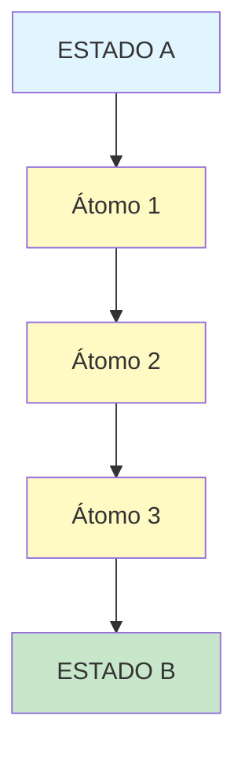

### Com Feedback Loop

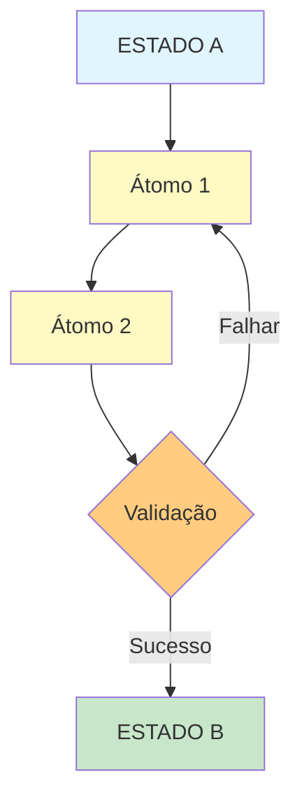

### Paralelo

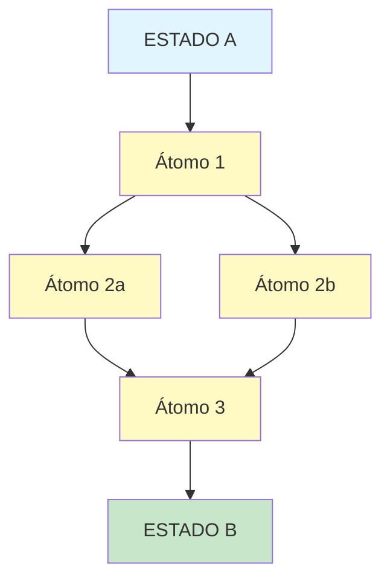

---

## 2. Estrutura de Átomo

### Simples

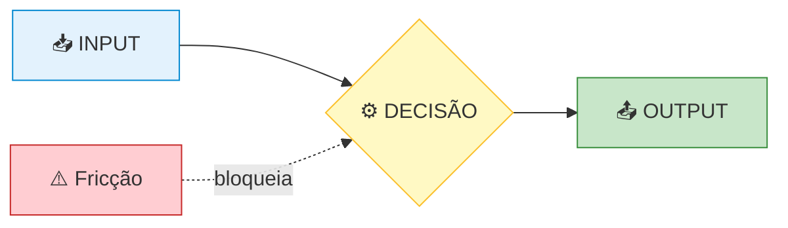

### Detalhado

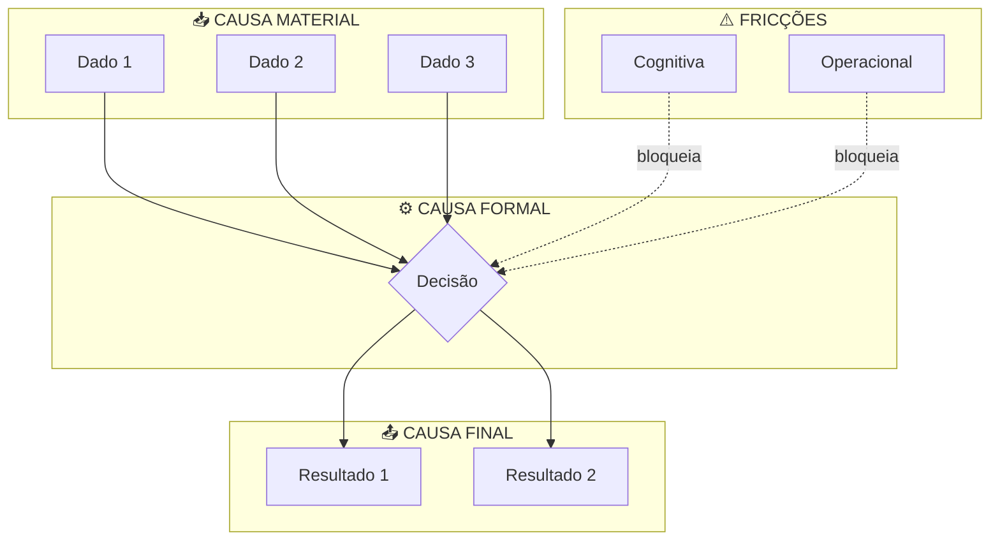

---

## 3. Matriz de Agentes

### Por Tipo

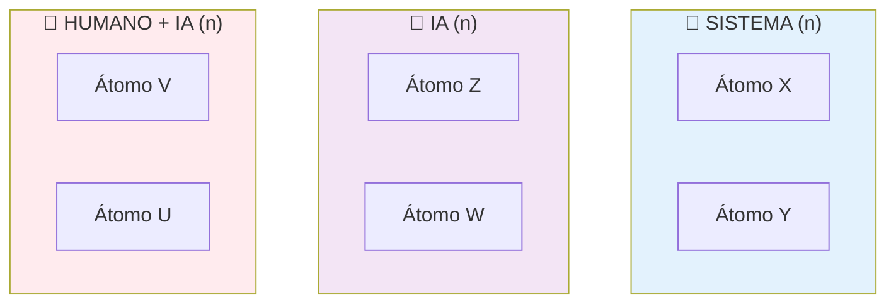

### Fluxo com Agentes

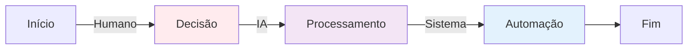

---

## 4. Equação Ke

### Básica

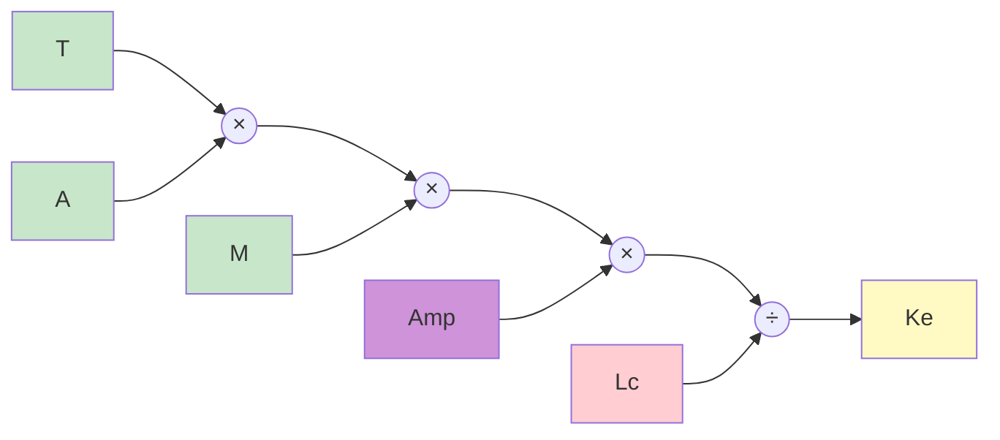

### Com Valores

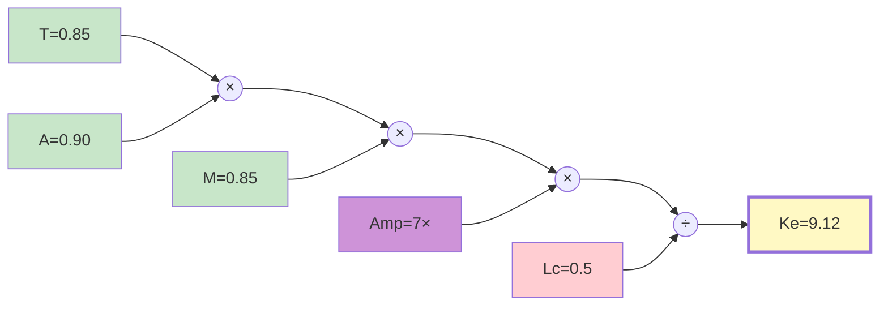

---

## 5. As 4 Causas

### Vertical

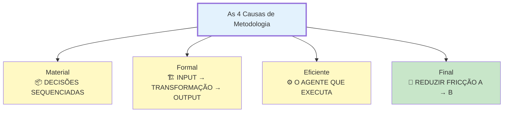

### Circular

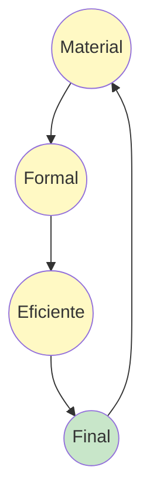

---

## 6. Anatomia de Metodologia (5 Partes)

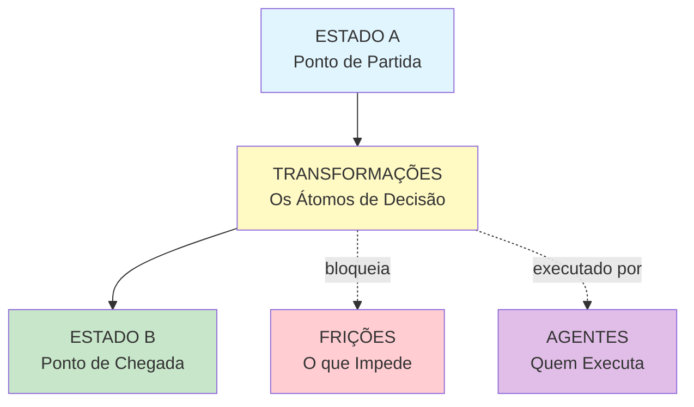

---

## 7. Pipeline de 7 Passos

### Horizontal

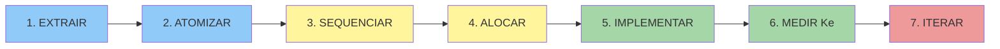

### Com Loop

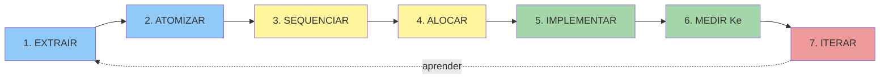

---

## 8. Comparativo Pré/Com-MAAS

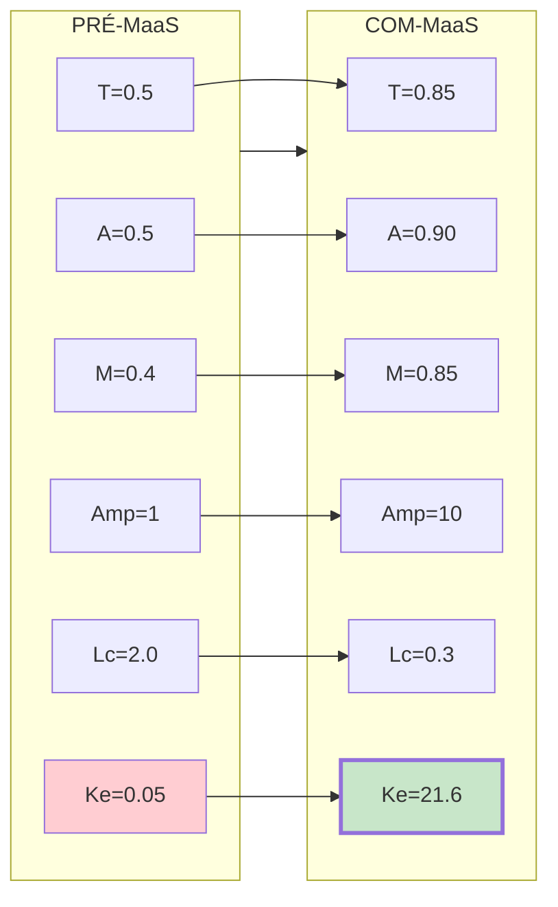

---

## 9. Matriz de Decisão (3 Perguntas)

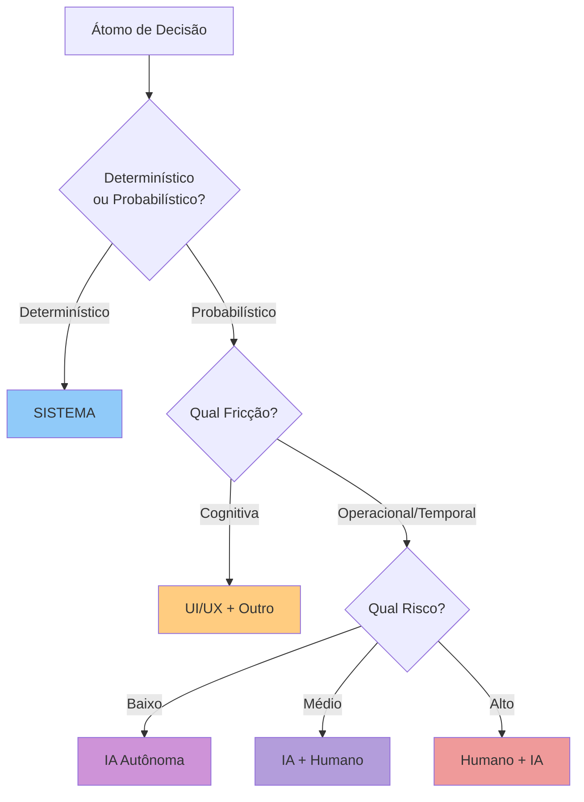

---

## 10. Mapa de Fricções

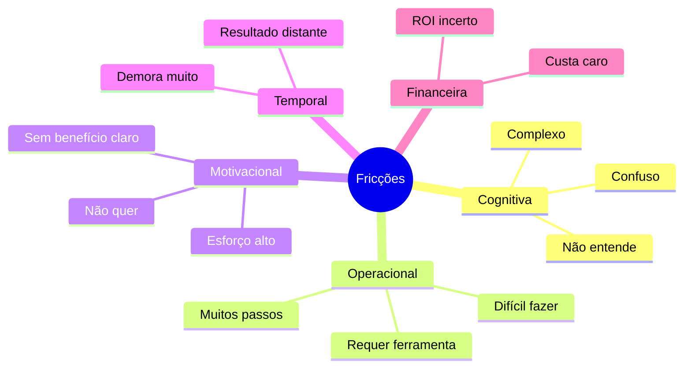

---

## Paleta de Cores MAAS

| Uso | Cor | Hex |
|-----|-----|-----|
| Estado A | Azul claro | `#e1f5ff` |
| Estado B | Verde claro | `#c8e6c9` |
| Átomo | Amarelo | `#fff9c4` |
| Fricção | Vermelho claro | `#ffcdd2` |
| IA | Roxo claro | `#ce93d8` |
| Sistema | Azul | `#90caf9` |
| Humano | Rosa claro | `#ef9a9a` |
| UI/UX | Laranja claro | `#ffcc80` |
| Ke/Resultado | Amarelo destaque | `#fff9c4` |

---

## Metadados

- **Versão:** 1.0
- **Data:** Janeiro 2025
- **Skill:** MAAS Documentation

---

**FIM DOS PADRÕES MERMAID**
