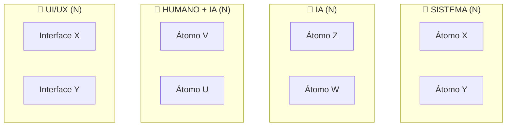

# TEMPLATE — MATRIZ DE ALOCAÇÃO DE AGENTES

> **Uso:** Preencha as seções marcadas com **[PREENCHER]**.
> **Objetivo:** Decidir qual agente (Humano, IA, Sistema, UI/UX) executa cada decisão.
> **Método:** 3 perguntas para cada átomo de decisão.

---

# Matriz de Alocação de Agentes: [NOME DA METODOLOGIA]

## As 3 Perguntas de Decisão

Para cada átomo, responda 3 perguntas para decidir o agente:

---

### Pergunta 1: O critério é DETERMINÍSTICO ou PROBABILÍSTICO?

| Tipo | Características | Agente Base |
|------|-----------------|-------------|
| **Determinístico** | Mesma entrada → mesma saída sempre | **SISTEMA** |
| **Probabilístico** | Variação, criatividade, julgamento | **IA** |

**Exemplos:**
- Determinístico: "Calcular ROI" → Sistema
- Probabilístico: "Escrever e-mail de vendas" → IA

---

### Pergunta 2: Qual a FRICÇÃO dominante?

| Fricção | Solução | Agente Complementar |
|---------|---------|---------------------|
| **Cognitiva** | Interface que guia | **UI/UX** |
| **Operacional** | Automatizar trabalho | **SISTEMA** |
| **Temporal** | Acelerar processo | **IA** |
| **Motivacional** | Engajar, mostrar progresso | **UI/UX** |
| **Financeira** | Reduzir custo | **SISTEMA/IA** |

---

### Pergunta 3: Qual o RISCO de erro?

| Risco | Abordagem | Agente |
|-------|-----------|--------|
| **Baixo** | Erro recuperável | **IA autônoma** |
| **Médio** | Revisão necessária | **IA + Humano** |
| **Alto** | Decisão crítica | **Humano + IA** |

---

## Tabela de Decisão (Matriz Completa)

Combine as 3 respostas para determinar o agente:

| Critério | Fricção | Risco | Agente | Descrição |
|----------|---------|-------|--------|-----------|
| Determinístico | Qualquer | Qualquer | **SISTEMA** | Código, regras, automação pura |
| Probabilístico | Temporal | Baixo | **IA (autônoma)** | IA sem revisão |
| Probabilístico | Temporal | Médio | **IA + Humano** | IA com revisão humana |
| Probabilístico | Temporal | Alto | **Humano + IA** | Humano decide, IA apoia |
| Qualquer | **Cognitiva** | Qualquer | **UI/UX + [outro]** | Interface que guia |

---

## Alocação por Átomo

### Lista de Átomos

| ID | Nome | 1. Tipo | 2. Fricção | 3. Risco | Agente | Justificativa |
|----|------|---------|------------|----------|--------|---------------|
| [A1] | [NOME] | [Det/Prob] | [COG/OP/MOT/TEMP/FIN] | [B/M/A] | [AGENTE] | [JUSTIFICATIVA] |
| [A2] | [NOME] | [Det/Prob] | [COG/OP/MOT/TEMP/FIN] | [B/M/A] | [AGENTE] | [JUSTIFICATIVA] |
| [A3] | [NOME] | [Det/Prob] | [COG/OP/MOT/TEMP/FIN] | [B/M/A] | [AGENTE] | [JUSTIFICATIVA] |
| [...] | [...] | [...] | [...] | [...] | [...] | [...] |

**Legenda:**
- **Det/Prob**: Determinístico / Probabilístico
- **COG/OP/MOT/TEMP/FIN**: Cognitiva / Operacional / Motivacional / Temporal / Financeira
- **B/M/A**: Baixo / Médio / Alto

---

## Resumo por Agente

### Distribuição

| Agente | Quantidade | % do Total |
|--------|------------|------------|
| **SISTEMA** | [N] | [%] |
| **IA (autônoma)** | [N] | [%] |
| **IA + Humano** | [N] | [%] |
| **Humano + IA** | [N] | [%] |
| **UI/UX** | [N] | [%] |
| **TOTAL** | [N] | 100% |

### Filosofia de Alocação

```
[PREENCHER — descreva a filosofia geral de alocação]

Exemplo:
"Automatizar tudo que é determinístico via sistemas.
Usar IA para tarefas probabilísticas de baixo risco.
Mantemos humanos no loop para decisões de alto risco.
UI/UX é usada para reduzir fricção cognitiva em pontos críticos."
```

---

## Visualização da Alocação



---

## Detalhamento por Agente

### SISTEMA

**Quando usar:** Critério determinístico

| Átomo | O que faz | Como implementar |
|-------|-----------|------------------|
| [NOME] | [DESCREVER] | [PREENCHER — API, script, regra] |

**Tecnologias sugeridas:** [PREENCHER]

---

### IA (autônoma)

**Quando usar:** Critério probabilístico, baixo risco

| Átomo | O que faz | Prompt base |
|-------|-----------|-------------|
| [NOME] | [DESCREVER] | [PREENCHER] |

**Modelo sugerido:** [PREENCHER — ex: GPT-4, Claude 3]

---

### IA + Humano

**Quando usar:** Critério probabilístico, médio risco

| Átomo | O que faz | Workflow |
|-------|-----------|----------|
| [NOME] | [DESCREVER] | 1. IA gera → 2. Humano revisa → 3. Aprova/Rejeita |

**Critério de aprovação:** [PREENCHER]

---

### Humano + IA

**Quando usar:** Alto risco, decisão crítica

| Átomo | O que faz | Workflow |
|-------|-----------|----------|
| [NOME] | [DESCREVER] | 1. Humano decide → 2. IA apoia com insights |

**Papel da IA:** [PREENCHER]

---

### UI/UX

**Quando usar:** Reduzir fricção cognitiva

| Átomo | O que faz | Elemento de UI |
|-------|-----------|----------------|
| [NOME] | [DESCREVER] | [PREENCHER — wizard, tooltip, guia] |

**Princípios:** [PREENCHER]

---

## Casos de Borda

### O que fazer quando:

| Situação | Decisão |
|----------|---------|
| Não é claro se é Det ou Prob | [PREENCHER] |
| Fricções mistas (mais de uma) | [PREENCHER] |
| Risco é subjetivo | [PREENCHER] |
| Agente escolhido não está disponível | [PREENCHER] |

---

## Revisão e Iteração

### Próxima Revisão

- **Data:** [PREENCHER]
- **O que revisar:** [PREENCHER]
- **Critérios:** [PREENCHER]

### Mudanças Planejadas

| Átomo | Agente Atual | Agente Proposto | Justificativa |
|-------|--------------|-----------------|---------------|
| [ID] | [ATUAL] | [PROPOSTO] | [POR QUÊ] |

---

## Metadados

- **Data:** [PREENCHER]
- **Versão:** 1.0
- **Metodologia:** [NOME]

---

**FIM DO TEMPLATE DE ALOCAÇÃO DE AGENTES**
