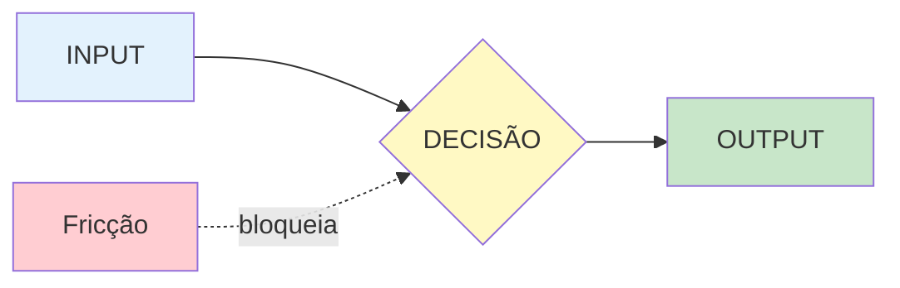

# TEMPLATE — ÁTOMO DE DECISÃO

> **Uso:** Preencha as seções marcadas com **[PREENCHER]**.
> **Objetivo:** Documentar uma única decisão atômica de uma metodologia.
> **Regra:** Se o átomo tem mais de 7 linhas de instruções, considere dividi-lo.

---

## Metadados

- **ID:** [PREENCHER — ex: atom-001, extract-decisions]
- **Nome:** [PREENCHER]
- **Versão:** 1.0
- **Expert:** [PREENCHER]
- **Data:** [PREENCHER]

---

## As 4 Causas (Aristotélicas)

### Causa Material (INPUT)

**O que é necessário ANTES de tomar esta decisão?**

- [PREENCHER — liste os dados, informações, contexto necessários]

**Exemplo prático:**
```
❌ "Informações do cliente"
✓ "Nome do cliente (obtido do CRM), últimas 3 compras (histórico),
   ticket médio (calculado), status atual (ativo/inativo)"
```

---

### Causa Formal (DECISÃO)

**Qual é a decisão exata que tomamos?**

- [PREENCHER — escreva como uma instrução executável]

**Exemplo prático:**
```
❌ "Analisar o cliente"
✓ "Abrir o CRM, clicar em 'Histórico', verificar as últimas 3 compras
   e identificar padrões de consumo por categoria"
```

---

### Causa Eficiente (AGENTE)

**Quem executa esta decisão?**

- [ ] **SISTEMA** — Determinístico, mesma entrada → mesma saída
- [ ] **IA (autônoma)** — Probabilístico, baixo risco
- [ ] **IA + Humano** — Probabilístico, médio risco (revisão necessária)
- [ ] **Humano + IA** — Alto risco, humano decide
- [ ] **UI/UX + [outro]** — Reduz fricção cognitiva

**Agente selecionado:** [PREENCHER]

**Justificativa (Matriz de 3 Perguntas):**
1. Critério: [Determinístico/Probabilístico]
2. Fricção dominante: [Cognitiva/Operacional/Motivacional/Temporal/Financeira]
3. Risco de erro: [Baixo/Médio/Alto]

---

### Causa Final (OUTPUT)

**O que temos APÓS tomar a decisão?**

- [PREENCHER — descreva o resultado tangível/mensurável]

**Exemplo prático:**
```
❌ "Cliente analisado"
✓ "Lista de 3 categorias de produtos com maior probabilidade de compra,
   com score de confiança (0-100) para cada categoria"
```

---

## Diagrama do Átomo



**Legenda:**
- **INPUT** = [descrever resumidamente]
- **DECISÃO** = [descrever resumidamente]
- **OUTPUT** = [descrever resumidamente]
- **Fricção** = [PREENCHER — qual fricção domina?]

---

## Fricções Identificadas

Marque as fricções que se aplicam a este átomo:

| Fricção | Descrição | Presente? | Severidade | Mitigação |
|---------|-----------|-----------|------------|-----------|
| **Cognitiva** | Não entende o que fazer | [ ] | Baixa/Média/Alta | [PREENCHER] |
| **Operacional** | Difícil de executar | [ ] | Baixa/Média/Alta | [PREENCHER] |
| **Motivacional** | Não quer fazer | [ ] | Baixa/Média/Alta | [PREENCHER] |
| **Temporal** | Demora muito | [ ] | Baixa/Média/Alta | [PREENCHER] |
| **Financeira** | Custa caro | [ ] | Baixa/Média/Alta | [PREENCHER] |

---

## Critérios de Sucesso

**Como saber que a decisão foi tomada corretamente?**

- [ ] [PREENCHER — critério mensurável 1]
- [ ] [PREENCHER — critério mensurável 2]
- [ ] [PREENCHER — critério mensurável 3]

**Exemplo:**
```
✓ "Output gerado em menos de 30 segundos"
✓ "Categoria com maior score tem 80%+ de confiança"
✓ "Resultado é validado pelo usuário (aprovação explícita)"
```

---

## Dependências

**Átomos que devem vir ANTES deste:**
- [PREENCHER — liste IDs ou nomes dos átomos predecessores]

**Átomos que dependem DESTE:**
- [PREENCHER — liste IDs ou nomes dos átomos sucessores]

---

## Template de Execução (para o Agente)

Se o agente for **IA**, use este prompt template:

```
# Papel
Você são [AGENTE], especialista em [DOMÍNIO].

# Input
Você receberá: [DESCREVER INPUT]

# Tarefa
[DESCREVER DECISÃO como instrução clara]

# Output esperado
[DESCREVER OUTPUT com formato especificado]

# Restrições
- [PREENCHER restrições se houver]
```

Se o agente for **SISTEMA**, use este pseudo-código:

```python
def [NOME_FUNCAO](input_data):
    """
    [DESCREVER O QUE A FUNÇÃO FAZ]
    """
    # [PREENCHER lógica]

    return output_data
```

---

## Notas e Aprendizados

- [PREENCHER — observações, edge cases, melhorias futuras]

---

## Histórico de Versões

| Versão | Data | Alterações | Autor |
|--------|------|------------|-------|
| 1.0 | [DATA] | Versão inicial | [AUTOR] |

---

**FIM DO TEMPLATE DE ÁTOMO**
