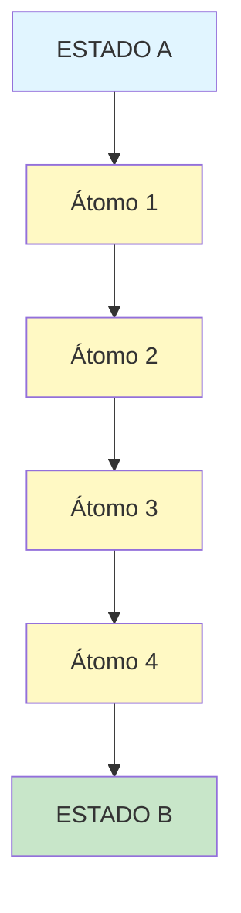
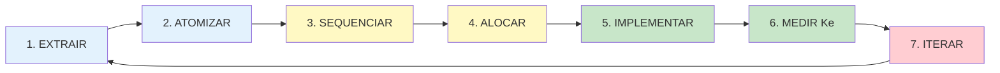

# TEMPLATE — METODOLOGIA COMPLETA MAAS

> **Uso:** Preencha as seções marcadas com **[PREENCHER]**.
> **Objetivo:** Documentar uma metodologia completa usando o framework MAAS.
> **Resultado:** Documento estruturado com 4 Causas, 5 Partes, Átomos, Agentes e Ke.

---

# [NOME DA METODOLOGIA]

## Snapshot

| Campo | Conteúdo |
|-------|----------|
| **Expert** | [PREENCHER — nome do especialista] |
| **Propósito** | [PREENCHER — uma frase] |
| **Transformação** | [ESTADO A] → [ESTADO B] |
| **Público** | [PREENCHER — quem usa esta metodologia] |
| **Data** | [PREENCHER] |
| **Versão** | 1.0 |

---

## As 4 Causas (Definição Aristotélica)

### 1. Causa Material — Do que é feito?

**DECISÕES SEQUENCIADAS**

A metodologia é composta por [N] decisões sequenciadas:

1. [DECISÃO 1]
2. [DECISÃO 2]
3. [DECISÃO 3]
...
N. [DECISÃO N]

> "A unidade atômica de uma metodologia não é o conceito — é a DECISÃO."

---

### 2. Causa Formal — Qual a estrutura?

**INPUT → TRANSFORMAÇÃO → OUTPUT** (em cascata)

```
┌─────────┐      ┌──────────────────┐      ┌─────────┐
│  INPUT  │ ───→ │  TRANSFORMAÇÃO   │ ───→ │ OUTPUT  │
│(Estado A│      │   (Decisão)      │      │(Estado B│
│  Inicial)│      └──────────────────┘      └─────────┘
└─────────┘              ↓                    ↓
                         │              (vira Input
                         │               do próximo)
                         ↓
```

**Estrutura em cascata:**
- Output do Átomo 1 → Input do Átomo 2
- Output do Átomo 2 → Input do Átomo 3
- [...]
- Output do Átomo N → Estado B final

---

### 3. Causa Eficiente — O que faz funcionar?

**O AGENTE QUE EXECUTA**

A metodologia usa os seguintes agentes:

| Agente | Quantidade de Átomos | % do total |
|--------|---------------------|------------|
| **SISTEMA** | [N] | [%] |
| **IA (autônoma)** | [N] | [%] |
| **IA + Humano** | [N] | [%] |
| **Humano + IA** | [N] | [%] |
| **UI/UX** | [N] | [%] |
| **TOTAL** | [N] | 100% |

**Filosofia de alocação:** [PREENCHER — ex: "Automatizar o determinístico, IA para probabilístico de baixo risco"]

---

### 4. Causa Final — Para que serve?

**REDUZIR FRICÇÃO A → B**

Esta metodologia existe para que alguém chegue ao **[ESTADO B]** sem redescobrir as decisões que o **[EXPERT]** tomou.

**Problema que resolve:**
- [PREENCHER — qual fricção principal?]

**Promessa:**
- [PREENCHER — o que someone ganha ao usar?]

---

## Anatomia Completa (5 Partes)

### Parte 1: ESTADO A — Ponto de Partida

**Onde o usuário está ANTES de aplicar a metodologia.**

#### Quem é? (Avatar)
- [PREENCHER — descreva a pessoa, não abstrações]
- Ex: "Gerente de produto em SaaS B2B, 3-5 anos de experiência"

#### O que TEM? (Recursos)
- [PREENCHER — recursos disponíveis]
- Ex: "Dados de uso, acesso a clientes, time de 3 devs"

#### O que NÃO TEM? (Gap)
- [PREENCHER — o que falta]
- Ex: "Processo estruturado para priorizar features"

#### Por que mudar? (Dor)
- [PREENCHER — motivação]
- Ex: "Features erradas sendo construídas, churn aumentando"

---

### Parte 2: TRANSFORMAÇÕES — Os Átomos de Decisão

**Cada passo é uma decisão que transforma o estado.**



#### Lista de Átomos

| ID | Nome | Input | Decisão | Output | Agente | Fricção Principal |
|----|------|-------|---------|--------|--------|-------------------|
| [A1] | [NOME] | [INPUT] | [DECISÃO] | [OUTPUT] | [AGENTE] | [FRIÇÃO] |
| [A2] | [NOME] | [INPUT] | [DECISÃO] | [OUTPUT] | [AGENTE] | [FRIÇÃO] |
| [A3] | [NOME] | [INPUT] | [DECISÃO] | [OUTPUT] | [AGENTE] | [FRIÇÃO] |
| [...] | [...] | [...] | [...] | [...] | [...] | [...] |

> **Dica:** Para documentar cada átomo em detalhes, use `templates/atom.md`

---

### Parte 3: ESTADO B — Ponto de Chegada

**Onde o usuário está APÓS aplicar a metodologia.**

#### O que TEM agora? (Resultado)
- [PREENCHER — resultado concreto]

#### O que MUDOU? (Delta A→B)
- [PREENCHER — antes vs depois]

#### Como SABER? (Evidência)
- [PREENCHER — critérios mensuráveis]

**Exemplo:**
```
✓ "Framework de priorização documentado"
✓ "Backlog organizado por score (0-100)"
✓ "Time alinhado nos critérios de decisão"
```

---

### Parte 4: FRICÇÕES — O que Impede

**Barreiras em cada transformação.**

| Átomo | Fricção Cognitiva | Fricção Operacional | Fricção Motivacional | Fricção Temporal | Fricção Financeira |
|-------|-------------------|---------------------|----------------------|------------------|-------------------|
| [A1] | [DESCREVER] | [DESCREVER] | [DESCREVER] | [DESCREVER] | [DESCREVER] |
| [A2] | [DESCREVER] | [DESCREVER] | [DESCREVER] | [DESCREVER] | [DESCREVER] |
| [A3] | [DESCREVER] | [DESCREVER] | [DESCREVER] | [DESCREVER] | [DESCREVER] |

**Como endereçar:**
- **Cognitiva** → UI/UX que guia
- **Operacional** → Sistemas que automatizam
- **Motivacional** → Quick wins, visibilidade de progresso
- **Temporal** → IA que acelera
- **Financeira** → ROI claro, alternativas low-cost

---

### Parte 5: AGENTES — Quem Executa

**Motor de cada decisão.**

#### Matriz de Alocação

Use `templates/agent-allocation.md` para documentar a alocação completa.

#### Resumo por Agente

| Agente | Quando Usar | Exemplo nesta Metodologia |
|--------|-------------|---------------------------|
| **SISTEMA** | Critério determinístico | [EXEMPLO] |
| **IA** | Probabilístico, baixo risco | [EXEMPLO] |
| **IA + Humano** | Probabilístico, médio risco | [EXEMPLO] |
| **Humano + IA** | Alto risco | [EXEMPLO] |
| **UI/UX** | Reduzir fricção cognitiva | [EXEMPLO] |

---

## Pipeline (7 Passos do MAAS)



### Status Atual

| Passo | Status | Data | Observações |
|-------|--------|------|-------------|
| 1. EXTRAIR | [PENDENTE/CONCLUÍDO] | [DATA] | [OBS] |
| 2. ATOMIZAR | [PENDENTE/CONCLUÍDO] | [DATA] | [OBS] |
| 3. SEQUENCIAR | [PENDENTE/CONCLUÍDO] | [DATA] | [OBS] |
| 4. ALOCAR | [PENDENTE/CONCLUÍDO] | [DATA] | [OBS] |
| 5. IMPLEMENTAR | [PENDENTE/CONCLUÍDO] | [DATA] | [OBS] |
| 6. MEDIR Ke | [PENDENTE/CONCLUÍDO] | [DATA] | [OBS] |
| 7. ITERAR | [PENDENTE/CONCLUÍDO] | [DATA] | [OBS] |

---

## Equação Ke (Conhecimento Efetivo)

**Use `templates/ke-calculation.md` para o cálculo completo.**

### Resumo

```
        T × A × M × AmpIA
Ke = ─────────────────────
              Lc
```

| Variável | Valor | Alvo | Status |
|----------|-------|------|--------|
| T (Transferibilidade) | [X.XX] | 0.8+ | [⚠️/✓] |
| A (Aplicabilidade) | [X.XX] | 0.8+ | [⚠️/✓] |
| M (Metodização) | [X.XX] | 0.8+ | [⚠️/✓] |
| Amp (Amplificador IA) | [X.XX] | 5.0+ | [⚠️/✓] |
| Lc (Limite Cognitivo) | [X.XX] | <0.5 | [⚠️/✓] |

### Resultado

- **Ke PRÉ-MaaS:** [X.XX]
- **Ke COM-MaaS:** [X.XX]
- **Multiplicador:** [X]×

---

## Apêndice

### Glossário

| Termo | Definição |
|-------|-----------|
| **Átomo** | Unidade mínima de decisão (Input + Decisão + Output) |
| **Fricção** | Barreira que impede a execução de uma decisão |
| **Agente** | Quem executa a decisão (Humano, IA, Sistema, UI/UX) |
| **Ke** | Conhecimento Efetivo — métrica de capacidade de transformação |

### Referências

- [LINK 1]
- [LINK 2]
- [LINK 3]

---

## Metadados do Documento

- **Data de criação:** [PREENCHER]
- **Última atualização:** [PREENCHER]
- **Versão:** 1.0
- **Autores:** [PREENCHER]
- **Revisores:** [PREENCHER]

---

**FIM DO TEMPLATE DE METODOLOGIA**
